# Dynamic-Net: Tuning the Objective Without Re-training [[paper]](https://arxiv.org/abs/1811.08760) [[project page]](https://cgm.technion.ac.il/Computer-Graphics-Multimedia/Software/DynamicNet/)

Alon Shoshan, [Roey Mechrez](http://cgm.technion.ac.il/people/Roey/), [Lihi Zelnik-Manor](http://lihi.eew.technion.ac.il/)<br>
[Technion - Israel Institute of Technology](http://cgm.technion.ac.il/)

<div align='center'>
  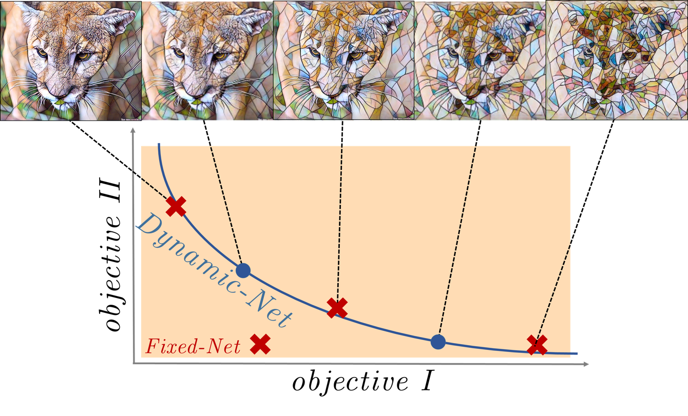
</div>

**Abstract:**<br>
One of the key ingredients for successful optimization of modern CNNs is identifying a suitable objective. To date, the objective is fixed a-priori at training time, and any variation to it requires re-training a new network. In this paper we present a first attempt at alleviating the need for re-training. Rather than fixing the network at training time, we train a "Dynamic-Net" that can be modified at inference time. Our approach considers an "objective-space" as the space of all linear combinations of two objectives, and the Dynamic-Net can traverse this objective-space at test-time, without any further training. We show that this upgrades pre-trained networks by providing an out-of-learning extension, while maintaining the performance quality. The solution we propose is fast and allows a user to interactively modify the network, in real-time, in order to obtain the result he/she desires. We show the benefits of such an approach via several different applications.

## Applications
### Dynamic Style Transfer [[Code & Setup](https://github.com/AlonShoshan10/dynamic_net/tree/master/dynamic_style_transfer)]

<div align='center'>
  
  
  <b>Control over Stylization level</b><br>
  <br>
  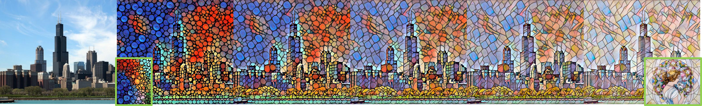
  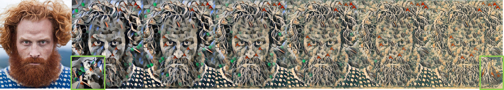
  <b>Interpolation between two Styles</b><br>
  <br>
</div>

### Dynamic DCGAN: Controlled Image Generation [[Code & Setup](https://github.com/AlonShoshan10/dynamic_net/tree/master/dynamic_dcgan)]

<div align='center'>
  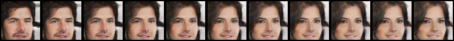
  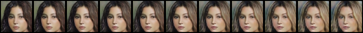<br>
  <b>The proposed method allow us to generate faces with control over the facial attributes e.g gender or hair color</b><br>
</div>
<br>

### Image Completion
<div align='center'>
  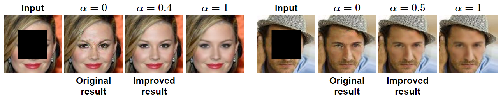
</div>
<!--<table style="width:400">
  <tr>
    <th>Input</th>
    <th>α=0</th> 
    <th>α=0.4</th>
    <th>α=1</th>
    <th>&nbsp;&nbsp;</th>
    <th>Input</th>
    <th>α=0</th> 
    <th>α=0.5</th>
    <th>α=1</th>
  </tr>
  <tr>
    <th>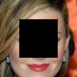</th>
    <th>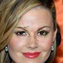</th>
    <th></th>
    <th>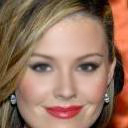</th>
    <th>&nbsp;&nbsp;</th>
    <th>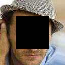</th>
    <th>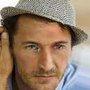</th>
    <th>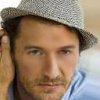</th>
    <th></th>
  </tr>
  <tr>
    <th></th>
    <th>Original result</th> 
    <th>Improved result</th>
    <th></th>
    <th>&nbsp;&nbsp;&nbsp;</th>
    <th></th>
    <th>Original result</th> 
    <th>Improved result</th> 
    <th></th>
  </tr>
</table>
<div align='center'>
<b>Dynamic-Net allows the user to select the best working point for each image, improving results of networks that were trained with sub-optimal objectives</b><br>
</div>-->


## Code
Code for every application is written as a separate project:
* [Dynamic Style Transfer](https://github.com/AlonShoshan10/dynamic_net/tree/master/dynamic_style_transfer)
* [Dynamic DCGAN](https://github.com/AlonShoshan10/dynamic_net/tree/master/dynamic_dcgan)

<div align='center'>
  <table style="width:100%">
    <tr>
      <th>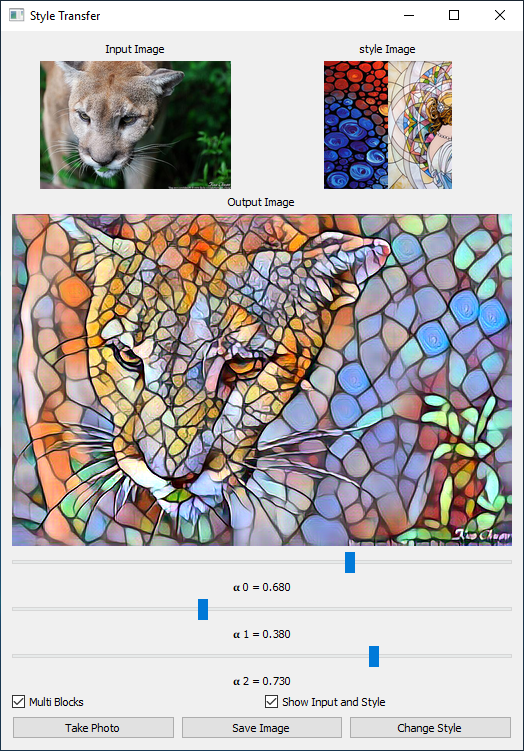</th>
      <th>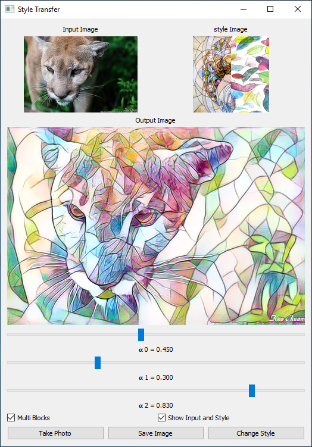</th>
      <th>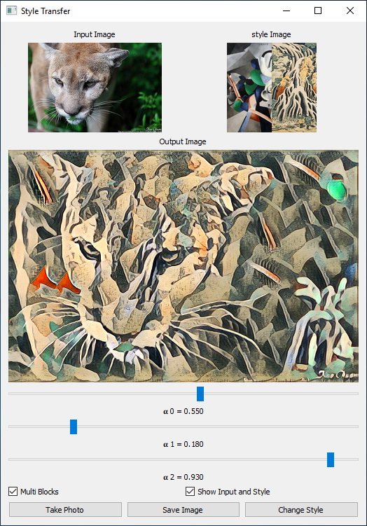</th>
    </tr>
  </table>
  <b>Dynamic style transfer demo</b><br>
</div>

## Citation
If you use our code for research, please cite our paper:
```
@article{shoshan2018dynamic,
  title={Dynamic-Net: Tuning the Objective Without Re-training},
  author={Shoshan, Alon and Mechrez, Roey and Zelnik-Manor, Lihi},
  journal={arXiv preprint arXiv:1811.08760},
  year={2018}
}
```

## Acknowledgments
Code for the style transfer network implementation borrows from [[1](https://github.com/pytorch/examples/tree/master/fast_neural_style)][[2](https://github.com/ceshine/fast-neural-style)].<br>
Code for the DCGAN network implementation borrows from [[1](https://github.com/pytorch/examples/tree/master/dcgan)].


