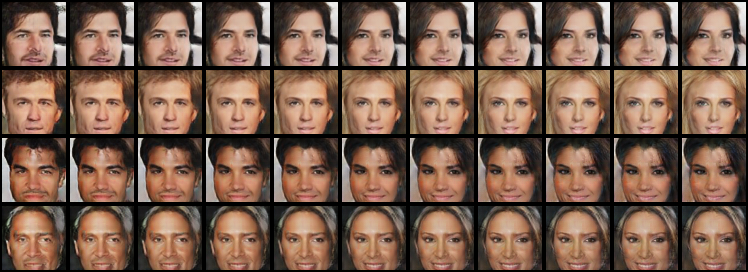
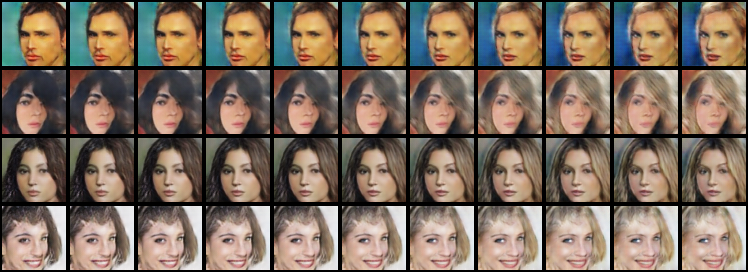
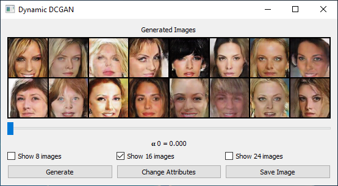
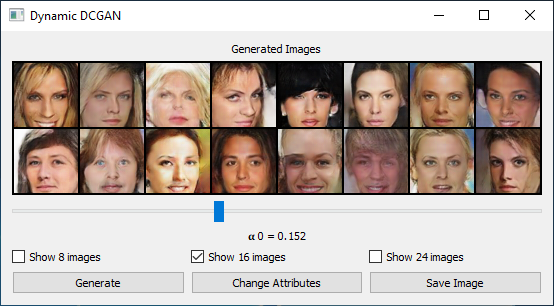
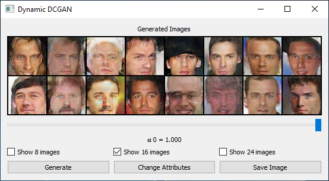
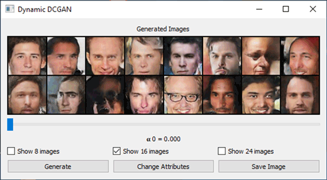

# Dynamic DCGAN
Official pyTorch implementation of the controlled generation experiments reported in the following paper:<br>
**Dynamic-Net: Tuning the Objective Without Re-training [[paper]](https://arxiv.org/abs/1811.08760) [[project page]](https://cgm.technion.ac.il/Computer-Graphics-Multimedia/Software/DynamicNet/)**<br>
Alon Shoshan, [Roey Mechrez](http://cgm.technion.ac.il/people/Roey/), [Lihi Zelnik-Manor](http://lihi.eew.technion.ac.il/)<br>
[Technion - Israel Institute of Technology](http://cgm.technion.ac.il/)

<div align='center'>
  <table style="width:100%">
    <tr>
      <th>Male to Female</th>
      <th>Dark hair to Blond hair</th>
    </tr>
    <tr>
      <th></th>
      <th></th>
    </tr>
  </table>
</div>

**Controlled generation results:** We split the dataset into two sub-sets, e.g., dark hair vs. blond. Both, the main-network and the tuning-blocks were trained with an adversarial loss, but with different data sub-set. This allow us to control generation of different facial attributes at inference.

## Demo
Try our demo and generate faces with control over a specific attribute.<br>
<br>
<!--**Example: Male to Female**
<div align='center'>
  <table style="width:100%">
    <tr>
      <th></th>
      <th></th>
      <th></th>
    </tr>
  </table>
</div>-->

<div align='center'>
  Male to Female<br>
  
</div>


## Setup

**Requirements:**<br>
```
pytorch
skimage
```
For the Demo also:
```
pyside2
cv2
```

**Demo:**<br>
1. Download The pre-trained networks of the demo [here](https://drive.google.com/open?id=1ZoBm_Hjn_l3Bpyz7idxH9FzFWVOtHKqN) and save them in `trained_nets` folder.
2. Run `python demo.py`.
3. Enjoy :).

**Inferene:**<br>
1. Download The pre-trained networks [here](https://drive.google.com/open?id=1ZoBm_Hjn_l3Bpyz7idxH9FzFWVOtHKqN) and save them in `trained_nets` folder or save your trained network (folder containing `model_dir` and `confix.txt`) in `trained_nets` folder.
2. Run: `python inferene.py --network_name=<network folder name>`.
3. Your results will be saved in `results/inference_results`.

**Training:**<br>
1. Run: `python train.py --experiment_name=<name> --discriminator_main_attr=<main network attribute> --discriminator_main_attr_is=<True/False> --discriminator_tuning_blocks_attr=<tuning blocks attribute> --discriminator_tuning_blocks_attr_is=<True/False>`.<br>
**Example:** `python train.py --experiment_name=male2female --discriminator_main_attr=Male --discriminator_main_attr_is=True --discriminator_tuning_blocks_attr=Male --discriminator_tuning_blocks_attr_is=False`.
2. Your trained network will be saved in `experiments`.

## Citation
If you use our code for research, please cite our paper:
```
@article{shoshan2018dynamic,
  title={Dynamic-Net: Tuning the Objective Without Re-training},
  author={Shoshan, Alon and Mechrez, Roey and Zelnik-Manor, Lihi},
  journal={arXiv preprint arXiv:1811.08760},
  year={2018}
}
```

## Acknowledgments
Code for the network implementation borrows from [[1](https://github.com/pytorch/examples/tree/master/dcgan)].
