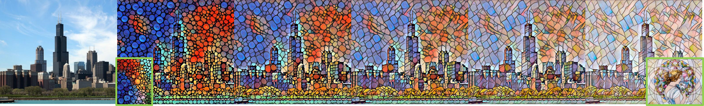
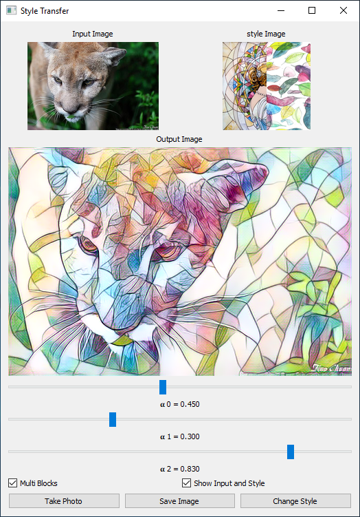

# Dynamic Style Transfer
Official pyTorch implementation of the style transfer experiments reported in the following paper:<br>
**Dynamic-Net: Tuning the Objective Without Re-training [[paper]](https://arxiv.org/abs/1811.08760) [[project page]](https://cgm.technion.ac.il/Computer-Graphics-Multimedia/Software/DynamicNet/)**<br>
Alon Shoshan, [Roey Mechrez](http://cgm.technion.ac.il/people/Roey/), [Lihi Zelnik-Manor](http://lihi.eew.technion.ac.il/)<br>
[Technion - Israel Institute of Technology](http://cgm.technion.ac.il/)


<div align='center'>
  
  
  <b>Control over Stylization level</b><br>
  <br>
  
  
  <b>Interpolation between two Styles</b><br>
  <br>
</div>


**Abstract:**<br>
One of the key ingredients for successful optimization of modern CNNs is identifying a suitable objective. To date, the objective is fixed a-priori at training time, and any variation to it requires re-training a new network. In this paper we present a first attempt at alleviating the need for re-training. Rather than fixing the network at training time, we train a "Dynamic-Net" that can be modified at inference time. Our approach considers an "objective-space" as the space of all linear combinations of two objectives, and the Dynamic-Net can traverse this objective-space at test-time, without any further training. We show that this upgrades pre-trained networks by providing an out-of-learning extension, while maintaining the performance quality. The solution we propose is fast and allows a user to interactively modify the network, in real-time, in order to obtain the result he/she desires. We show the benefits of such an approach via several different applications.

## Demo
Try our demo and easily design your own Images.
<div align='center'>
  <table style="width:100%">
    <tr>
      <!--<th></th>
      <th></th>-->
      <th></th>
      <th></th>
      <th></th>
    </tr>
  </table>
</div>

## Setup

**Requirements:**<br>
```
pytorch
skimage
```
For the Demo also:
```
pyside2
cv2
```


**Demo:**<br>
1. Download The pre-trained networks of the demo [here](https://drive.google.com/drive/folders/1zdxj94Y9754-dSxYKdSBe7BzzNmtenlr?usp=sharing) and save them in `trained_nets` folder.
2. Run `python demo.py`.
3. You can drag and drop an image to the GUI or click "Take Photo" to use your webcam.
4. Click "Save Image" to save, your results will be saved in `results/gui_results`.
5. Enjoy :).

**Inferene:**<br>
1. Download The pre-trained networks [here](https://drive.google.com/drive/folders/1zdxj94Y9754-dSxYKdSBe7BzzNmtenlr?usp=sharing) and save them in `trained_nets` folder or save your trained network (folder containing `model_dir` and `confix.txt`) in `trained_nets` folder.
2. Save your wanted content images in `images/inference_images`.
3. For pre-trained networks run: `python inferene.py --network_name=<network folder name> --use_saved_config=False --set_net_version=<normal/dual>`. For your trained network run: `python inferene.py --network_name=<network folder name> --use_saved_config=True --set_net_version=None`.
4. Your results will be saved in `results/inference_results`.

**Training:**<br>
1. Run `python train.py --experiment_name=<name> --main_style_image_name=<main_style_image_name> --tuning_blocks_style_image_name=<tuning blocks style image name> --main_style_wight=<main style wight> --blocks_style_wight=<blocks style wight>`.<br>
**Example:** `python train.py --experiment_name=mosaic2colors --main_style_image_name=mosaic --tuning_blocks_style_image_name=colors --main_style_wight=100000 --blocks_style_wight=100000`
2. Your trained network will be saved in `experiments`.

## Citation
If you use our code for research, please cite our paper:
```
@article{shoshan2018dynamic,
  title={Dynamic-Net: Tuning the Objective Without Re-training},
  author={Shoshan, Alon and Mechrez, Roey and Zelnik-Manor, Lihi},
  journal={arXiv preprint arXiv:1811.08760},
  year={2018}
}
```

## Acknowledgments
Code for the network implementation borrows from [[1](https://github.com/pytorch/examples/tree/master/fast_neural_style)][[2](https://github.com/ceshine/fast-neural-style)].


